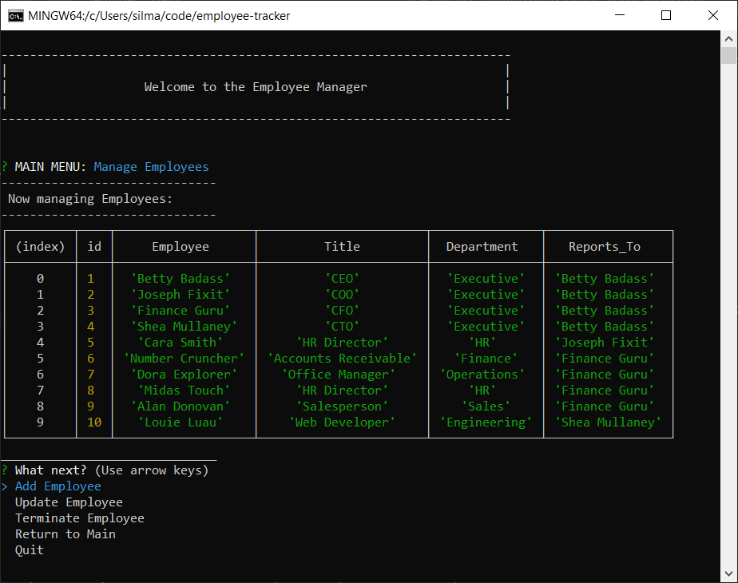

# Employee Tracker Using MySQL/Node.js

## Description

This CLI application is built using Node.js to manipulate employee data within a MySQL database pre-populated with tables and seed data. (SQL schema and seed data are available in the accompanying repository.)
 
-------------
## User Story

As a business owner
I want to be able to view and manage the departments, roles, and employees in my company
So that I can organize and plan my business

-------------
## Application Requirements

This application will be complete when Users can:
  1. Add departments (DONE) 
  2. Add roles (COMING SOON)
  3. Add employees (COMING SOON)
  4. View departments (DONE) 
  5. View roles (DONE) 
  6. View employees (DONE) 
  7. Update employee roles 
  8. Update employee managers (COMING SOON)
  9. View employees by manager (COMING SOON)
  10. Delete departments (DONE)
  11. Delete roles (COMING SOON)
  12. Delete employees (COMING SOON)
  13. View combined salaries of all employees in a given department (COMING SOON)

------------
## Dependencies

This CLI app requires the following NPM packages:
* [MySQL](https://www.npmjs.com/package/mysql) to connect queries.
* [InquirerJs](https://www.npmjs.com/package/inquirer/v/0.2.3) to create the command-line interface.
-------------
## Demonstration

### Click the image to watch the video:

### DB Schema
 
